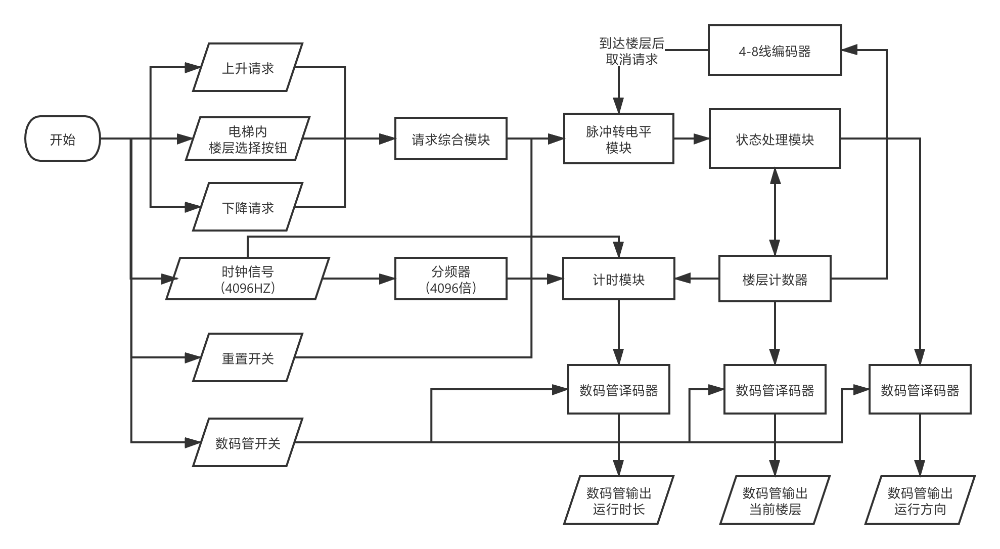
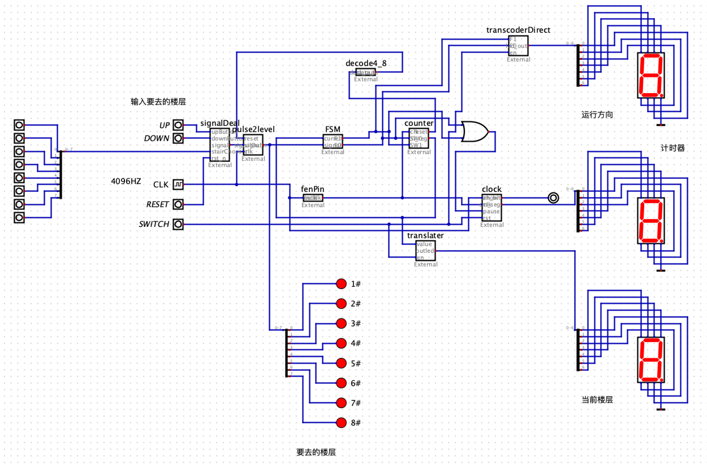

## 简易8层电梯控制器

使用Verilog HDL语言描述

## 设计目标

本项目的设计目标是一个8层电梯的控制器。主要输入有：各楼层电梯外上下按钮，电梯内楼层选择按钮，显示屏开关以及电梯重置按钮。

实现功能具体如下：

- 电梯可往返于1至8楼；
- 不同位置的用户可以同时请求电梯，电梯将按照以下原则运行
  - 上升时：若有上升请求，就近依次停梯；在无上升请求以后执行下降请求。
  - 下降时：若有下降请求，就近依次停梯；在无下降请求以后执行上升请求。
  - 无上升或下降请求时，电梯在原位置待机。
- 电梯楼层选择相关按钮均为脉冲触发；
- 任何时候触发重置电梯按钮，电梯将取消当前任务，并移动至1楼后停止；
- 在数码管上显示电梯当前位置和运行方向。
- 在数码管上显示电梯当次运行时长。

## 整体设计概述

由于项目触发方式多样，所以采用自顶向下的设计思路，使用模块化设计。

控制器对于信号的处理方式为：首先综合楼内各位置请求信号到一起，再将脉冲信号转为电平信号后交由状态处理模块处理。

状态处理模块会结合当前电梯运行方向，以及楼层计数器返回的当前楼层进行判断，输出电梯的下一状态（即电梯的运行方向），并发送至楼层计数器。

楼层计数器接收运行方向信息后，自动增减当前楼层数，同时将当前楼层从电梯请求列表中删除。当方向信息为0时，楼层计数器的输出不发生变化。

计时模块将记录电梯两次停梯的时间间隔，单位为1秒。

收到重置电梯的信号后，请求综合模块将清除全部请求信号，并将输出设定为请求到1楼。

## 仿真方法

使用[Digital](https://github.com/hneemann/Digital)进行仿真。

## 感谢

- https://github.com/1160300901/Elevator-Controller
- https://github.com/hneemann/Digital
- https://github.com/ElegantLaTeX/ElegantBook